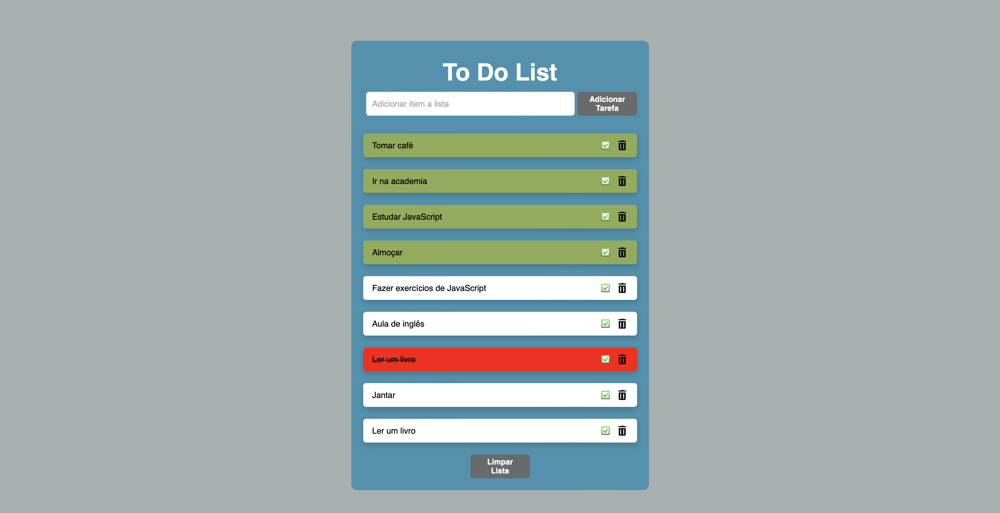

<h1 align="center"> To Do List </h1>

O Projeto To Do List permite ao usuário a criação de uma lista de tarefas para auxilia-lo no dia a dia. ElE oferece a possibilidade de criação e exclusão de tarrefas, definir tarefas como realizadas e limpar toda a lista de tarefa criada.
 

  

## 🚀 Tecnologias

Esse projeto foi desenvolvido com as seguintes tecnologias:

- HTML e CSS
- JavaScript
- Git e Github

## 💻 Projeto

- [Acesse o projeto finalizado, online.](https://jhonatansilva90.github.io/To-Do-List/)